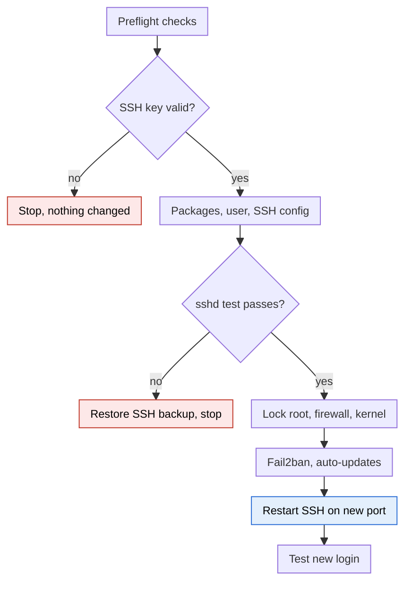

# server-setup.sh

**Platforms**


**Build**


**Security**


**Modes**


**Safety**


## What it does

One script for Ubuntu and Debian servers: update the system, harden a fresh server, and check its health. Run it with no arguments for a menu.

## Who it's for

It suits anyone who owns a Linux server and can log in as root over SSH. It is not for people who cannot get a key-based login working, or for systems that are not Debian-based.

| Use it if you are | Do not use it if |
| --- | --- |
| Setting up a new Ubuntu or Debian VPS or cloud server | The server runs RHEL, Rocky, Alma, Fedora, Arch or Alpine (they use `dnf`, `firewalld` or other tools) |
| A developer, indie hacker or small team without a dedicated sysadmin | You have no SSH key, or cannot reach the server any other way (console or provider recovery) if SSH breaks |
| Running a web app, API, bot or personal server | The server is shared or managed, so you do not have root (shared hosting, managed platforms) |
| Checking an existing server with `doctor`, which changes nothing | A server already managed by Ansible, Puppet or a hardened corporate image, where this would conflict |
| Keeping several servers consistent with the same command | A production system with strict change control, unless you test on a copy first |

It is a solid baseline, not a replacement for a full security review, compliance requirements (PCI, HIPAA) or a dedicated security team.

## Quick start

```bash
sudo bash server-setup.sh           # dashboard menu
sudo bash server-setup.sh doctor    # health check only

# full hardening, no prompts
NEW_USER=deploy SSH_PUBKEY="ssh-ed25519 AAAA..." SSH_PORT=2222 \
ALLOW_PORTS="80/tcp,443/tcp" sudo -E bash server-setup.sh full --yes
```

Before closing your root session, open a new terminal and confirm `ssh -p 2222 deploy@<server-ip>` works.

## Modes

| Command | What it does |
| --- | --- |
| `update` | `apt update` and `upgrade`. No settings changed |
| `upgrade` | `full-upgrade`, cleanup, offers a reboot if needed |
| `essential` | Sudo user with your key, key-only SSH, root locked, UFW, Fail2ban, automatic updates |
| `full` | Essential plus kernel and DDoS hardening, web flood limits, swap, log cap, admin tools |
| `doctor` | Read-only scan: PASS / WARN / FAIL, health score, recommended fixes. Exit code 0 / 1 / 2 |

## How it runs



Essential and Full follow this flow. The red boxes stop the run before SSH is changed live, and SSH restarts last, after the firewall already allows the port. If the custom firewall rules fail to load, the script falls back to plain UFW and continues.

## Do's and Don'ts

| Do | Don't |
| --- | --- |
| Run `doctor` first to see where the server stands | Run setup on a production server without a recent backup or snapshot |
| Keep your current SSH session open and test a new login in a second terminal before logging out | Close the session you ran the script from until the new login works |
| Make sure your SSH key works and you have provider console access as a fallback | Run it if you only log in with a password |
| Open the SSH port in your cloud provider's firewall if you change it | Change the SSH port without checking the provider's firewall allows it |
| Add your own IP to `FAIL2BAN_IGNOREIP` if you connect from a fixed address | Run many rapid SSH logins from scripts without allowing that IP, or Fail2ban will ban it |
| Set `WEB_CONN_LIMIT=0` behind Cloudflare or a load balancer | Leave per-IP web limits on when all visitors share a few proxy IPs |
| Use `update` or `upgrade` regularly, and reboot when `doctor` says so | Ignore pending security updates or reboot warnings |
| Re-run `doctor` after any change and keep the backup folder until you're sure | Edit `00-hardening.conf` by hand without running `sudo sshd -t` first |
| Use `ufw allow` for new services, then check with `doctor` | Publish Docker ports on `0.0.0.0` and assume UFW protects them |

## Good to know

- It needs root and an SSH public key, and refuses to turn off password login without one.
- Every changed file is backed up to `/root/server-setup-backup-<timestamp>/`; the log is `/var/log/server-setup.log`.
- If you change the SSH port, open it in your cloud provider's firewall too.
- Behind Cloudflare or a load balancer, run with `WEB_CONN_LIMIT=0` so real visitors aren't rate-limited.
- Docker's published ports bypass UFW; bind containers to `127.0.0.1`.
- Very large DDoS attacks need Cloudflare or your provider's protection; no server setting stops them.
- Settings are environment variables (`NEW_USER`, `SSH_PUBKEY`, `SSH_PORT`, `ALLOW_PORTS`, `TIMEZONE` and more); see the header of the script.
